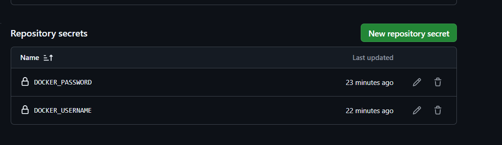
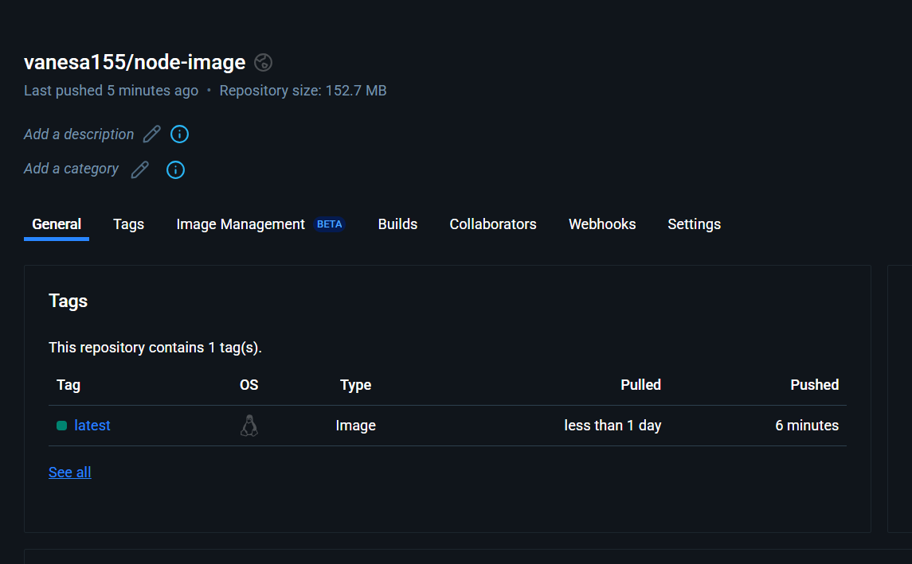

# Getting Started with Create React App

This project was bootstrapped with [Create React App](https://github.com/facebook/create-react-app).
hi

## Available Scripts

In the project directory, you can run:

### `npm start`

Runs the app in the development mode.\
Open [http://localhost:3000](http://localhost:3000) to view it in your browser.

The page will reload when you make changes.\
You may also see any lint errors in the console.

### `npm test`

Launches the test runner in the interactive watch mode.\
See the section about [running tests](https://facebook.github.io/create-react-app/docs/running-tests) for more information.

### `npm run build`

Builds the app for production to the `build` folder.\
It correctly bundles React in production mode and optimizes the build for the best performance.

The build is minified and the filenames include the hashes.\
Your app is ready to be deployed!

See the section about [deployment](https://facebook.github.io/create-react-app/docs/deployment) for more information.

### `npm run eject`

**Note: this is a one-way operation. Once you `eject`, you can't go back!**

If you aren't satisfied with the build tool and configuration choices, you can `eject` at any time. This command will remove the single build dependency from your project.

Instead, it will copy all the configuration files and the transitive dependencies (webpack, Babel, ESLint, etc) right into your project so you have full control over them. All of the commands except `eject` will still work, but they will point to the copied scripts so you can tweak them. At this point you're on your own.

You don't have to ever use `eject`. The curated feature set is suitable for small and middle deployments, and you shouldn't feel obligated to use this feature. However we understand that this tool wouldn't be useful if you couldn't customize it when you are ready for it.

## Learn More

You can learn more in the [Create React App documentation](https://facebook.github.io/create-react-app/docs/getting-started).

To learn React, check out the [React documentation](https://reactjs.org/).

### Code Splitting

This section has moved here: [https://facebook.github.io/create-react-app/docs/code-splitting](https://facebook.github.io/create-react-app/docs/code-splitting)

### Analyzing the Bundle Size

This section has moved here: [https://facebook.github.io/create-react-app/docs/analyzing-the-bundle-size](https://facebook.github.io/create-react-app/docs/analyzing-the-bundle-size)

### Making a Progressive Web App

This section has moved here: [https://facebook.github.io/create-react-app/docs/making-a-progressive-web-app](https://facebook.github.io/create-react-app/docs/making-a-progressive-web-app)

### Advanced Configuration

This section has moved here: [https://facebook.github.io/create-react-app/docs/advanced-configuration](https://facebook.github.io/create-react-app/docs/advanced-configuration)

### Deployment

This section has moved here: [https://facebook.github.io/create-react-app/docs/deployment](https://facebook.github.io/create-react-app/docs/deployment)

### `npm run build` fails to minify

This section has moved here: [https://facebook.github.io/create-react-app/docs/troubleshooting#npm-run-build-fails-to-minify](https://facebook.github.io/create-react-app/docs/troubleshooting#npm-run-build-fails-to-minify)

# Doc App en Docker

Este proyecto utiliza Docker para construir y correr una aplicación en Node.js con React.

## Descripción

El proceso comienza creando un `Dockerfile` basado en una imagen de Node.js de versión reciente. La aplicación se construye utilizando `npm install` y se ejecuta con el comando `npm start`. Para lograr esto, se modifica el `package.json` agregando el siguiente script:  
json
"start": "react-scripts start"
## Construcción y Ejecución

Para probar la aplicación localmente:

1. Construye la imagen de Docker con el comando:

    
sh
    docker build -t nede-image .
    
2. Corre el contenedor con:

    
sh
    docker run -p 3000:3000 node-image
    
La aplicación utiliza el puerto `3000` porque es el puerto al que expone la app.

## Acción de CI

En la acción de CI se realizan los siguientes pasos:

1. Se copia el código.
2. Se monta en una imagen de Node.js.
3. Se instalan las dependencias.
4. Se ejecuta el `docker buildx`.
5. Se accede al Docker Hub.
6. Se construye la imagen en Docker Hub.

### Consideraciones de Seguridad

Se utilizan secretos para gestionar el acceso al Docker Hub, según la recomendación del profesor.

### Imagen en Docker Hub

La imagen creada en Docker Hub se llama `node-image`

## <b> Autora </b>

+ [Gloria Vanesa](https://github.com/Vanesa155 "Vanesa V.")

